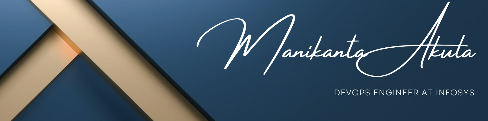

## 💫 About Me:
Hi 👋, I am Akula Sai Manikanta, currently working as a DevOps engineer at Infosys with 5.3 years of experience.

## 📊 GitHub Stats:

<table>
  <tr>
    <td align="center">
      
    </td>
    <td align="center">
      
    </td>
  </tr>
  <tr>
    <td colspan="2" align="center">
      
    </td>
  </tr>
</table>

## 🔝 Top Contributed Repo:

  

## 💻 Tech Stack:

 
 
 
 
 
 
 

## 🌐 Socials:
  

## 👾 Pacman Contribution Graph:

<picture>
  
</picture>

<!-- Proudly created with GPRM ( https://gprm.itsvg.in ) -->